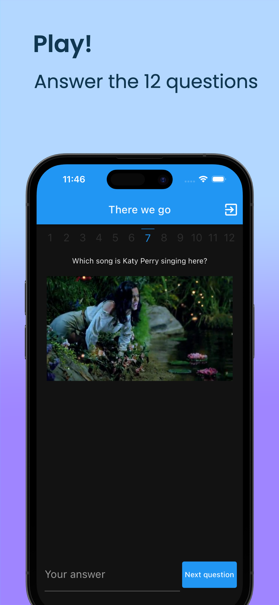
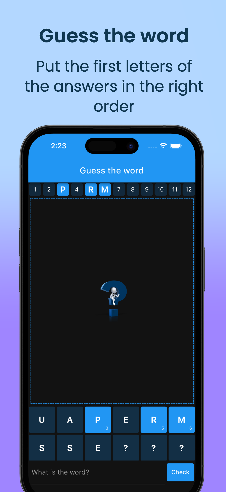
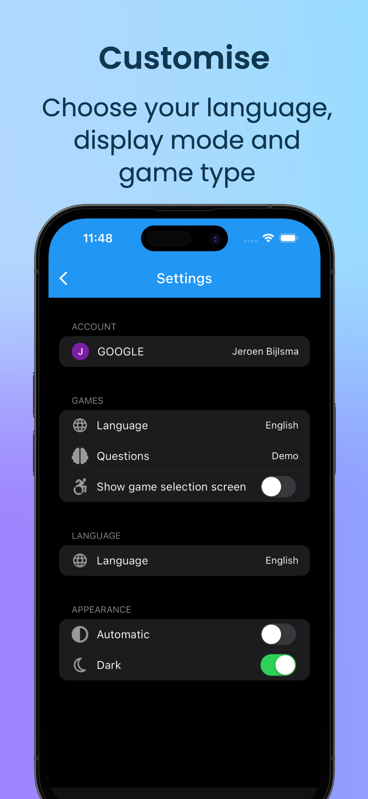
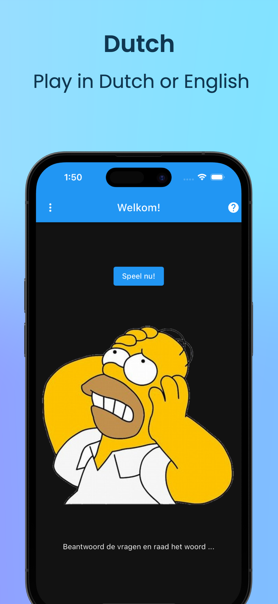
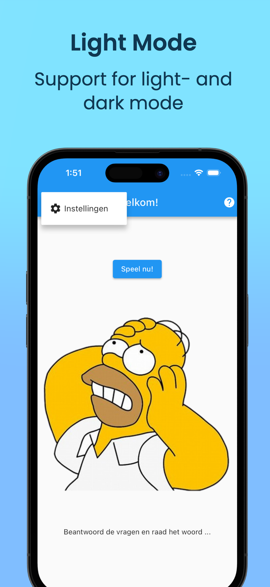
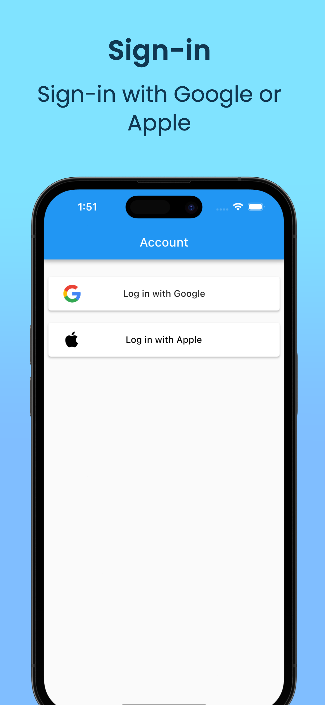

# 1 for 12 Game

Mobile iOS / Android App of the popular Dutch TV game show 'Twee voor 12'. You will get 12 questions. The first letters of the answers form a word, but the letters are not yet in the right order. After answering the questions, you are allowed to ask where in the word a letter belongs. The goal is to guess the word as fast as possible (i.e asking the minimum number of letters).

Apple App Store: https://apps.apple.com/us/app/1-for-12/id6468839095

  
  
  

  
  
  

  
  

These App screenshots were made using Screenshots Pro (https://screenshots.pro/) and the videos using Rotato (https://rotato.app/).

# Features

- Play multi media demo games both in English and Dutch
- Play Dutch games with random words and questions
- Support for English and Dutch
- Support for dark- and light mode
- Sign in using either your Google- or Apple Account

# Tech Stack

The iOS / Android App was built using Google Flutter. For the backend - the game API - multiple versions were written in NodeJs / Typescript and .NET 7 / C#. The backend APIs can be deployed to various Serverless Platforms: AWS Lambda, Google Cloud Serverless and Microsoft Azure Functions.

# Source Code Repositories (private)

| Description                                           | Repo                                                                    |
| ----------------------------------------------------- | ----------------------------------------------------------------------- |
| Front iOS / Android App - Flutter                     | https://github.com/one-for-twelve/dnw-one-for-twelve-flutter-2023       |
| AWS Lambda backend - nodejs / typescript              | https://github.com/one-for-twelve/dnw-one-for-twelve-nodejs-aws-sam     |
| Goole Firebase Function backend - nodejs / typescript | https://github.com/one-for-twelve/dnw-one-for-twelve-nodejs-firebase    |
| NPM package with Auth Api - nodejs / typescript       | https://github.com/one-for-twelve/dnw-one-for-twelve-nodejs-auth        |
| NPM package with Core Game Api - nodejs / typescript  | https://github.com/one-for-twelve/dnw-one-for-twelve-nodejs-core        |
| Verdaccio - local NPM registry / cache                | https://github.com/one-for-twelve/verdaccio                             |
| AWS Lambda backend - .NET 7 C#                        | https://github.com/one-for-twelve/Dnw.OneForTwelve.Aws                  |
| AWS Lambda backend - .NET 7 Native AOT C#             | https://github.com/one-for-twelve/Dnw.OneForTwelve.Aws.MinimalApi       |
| Microsoft Azure Function backend - .NET 7 C#          | https://github.com/one-for-twelve/one-for-twelve-Dnw.OneForTwelve.Azure |
| NuGet package with Core Game Api - .NET 7 C#          | https://github.com/one-for-twelve/Dnw.OneForTwelve.Core                 |
